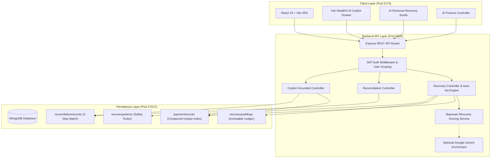
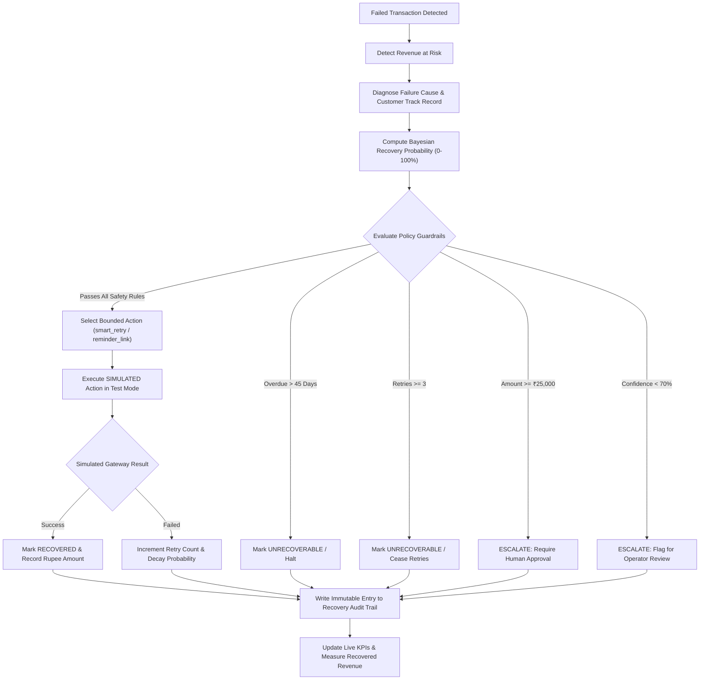

# WealthX — AI Revenue Recovery & Financial Intelligence Agent

> "Intelligence for Every Financial Decision"

> Developed by **Vijet Hegde**

**GitHub**: [https://github.com/VijetHegde17/WealthX](https://github.com/VijetHegde17/WealthX)  
**Buildathon Focus**: **Razorpay AI Buildathon** (Solo Project) — Primary: **Track 03 (AI Revenue Recovery)** • Secondary: **Track 04 (AI Finance Controller)**

---

> [!IMPORTANT]
> **SIMULATED / TEST MODE NOTICE & INTEGRATION STATUS**  
> WealthX currently operates in **SIMULATED / TEST MODE** using high-fidelity, deterministic synthetic datasets modeled after Indian digital payments and Razorpay failure scenarios. The system **does not** initiate live charges, debit real bank accounts, or execute live Razorpay production payment APIs. All payment recoveries, retry simulations, and 3-way reconciliations are executed against isolated database models with strict stopping rules.

---

## 📌 Executive Summary & Value Proposition

In digital commerce and SaaS, failed transactions and checkout drop-offs represent direct **revenue leakage**. Traditional payment systems rely on blind, static retries that annoy customers, trigger bank rate-limits, and increase churn.

**WealthX** transforms payment failure logs into an autonomous, closed-loop **AI Revenue Recovery & Finance Intelligence Agent**. Instead of unguided retries, WealthX implements an institutional 6-step recovery loop:

$$\textbf{DETECT} \longrightarrow \textbf{DIAGNOSE} \longrightarrow \textbf{DECIDE} \longrightarrow \textbf{ACT (TEST MODE)} \longrightarrow \textbf{MEASURE} \longrightarrow \textbf{AUDIT}$$

### Why WealthX Fits AI Revenue Recovery
- **Closed-Loop Intelligence**: Moves beyond static dashboard analytics into active decisioning, bounded recovery execution, live rupee measurement, and immutable audit logging.
- **Responsible AI & Human-in-the-Loop**: Autonomy is strictly bounded by deterministic safety guardrails. High-value payments ($\ge ₹25,000$) and low-confidence predictions ($< 70\%$) automatically halt and escalate for human approval.
- **Zero-Touch Out-of-the-Box Experience**: Automatically initializes realistic demo datasets for any newly registered user or evaluator, complete with dynamic non-zero metrics and robust multi-tenant isolation.

---

## 🏗️ System Architecture

WealthX is structured as a full-stack containerized micro-architecture running across React/Vite, Node.js/Express, and MongoDB.



---

## 🔄 Revenue Recovery Lifecycle Workflow

The flowchart below highlights how WealthX processes failed transactions while enforcing autonomous boundaries:



---

## 🌟 Core Features & Modules

### 1. AI Revenue Recovery Studio (`/revenue-recovery` — Track 03)
- **Automatic Initialization**: When an evaluator or judge logs into WealthX, the studio automatically detects user state and provisions 120 diverse synthetic payment records with non-zero backend metrics. No manual button clicking is required.
- **Dynamic KPI Cards**:
  - **Revenue At Risk**: Real-time sum of failed, pending, escalated, and unrecoverable revenue.
  - **Total Recovered (Test Mode)**: Rupee amount successfully recovered through AI actions.
  - **Recovery Conversion Rate**: Percentage of revenue saved versus total recoverable volume.
  - **Eligible for AI Retry**: Volume meeting all safety and confidence criteria.
  - **Safety Halts & Escalations**: Count of transactions paused by autonomous guardrails.
- **Interactive Opportunity Table**: Filter by Status (`Failed`, `Recovered`, `Escalated`, `Unrecoverable`), Segment (`Enterprise`, `SMB`, `VIP`, `Direct Consumer`), or Reason (`Gateway Timeout`, `Insufficient Funds`, `Bank Decline`, etc.).
- **Deep AI Diagnosis Modal**: Explains *why* the transaction failed, lists 3 supporting behavioral signals, outputs expected outcomes, and presents policy-aligned recommendations.
- **Single Bounded Execution**: Run simulated recoveries individually with real-time feedback and duplicate-action protection.

### 2. Autonomous Recovery Campaign
- **One-Click Batch Execution**: Processes all eligible opportunities across the portfolio simultaneously.
- **Safe Filtering**: Automatically skips high-value transactions and low-confidence transactions, routing them to the escalation queue.
- **Campaign Summary Modal**: Breaks down Analyzed Count, Eligible Count, Skipped Count, Attempted Count, Total Rupee Yield Recovered, and Effective Campaign Conversion Rate.

### 3. Recovery Strategy Simulator (`/recovery-simulator`)
- **Strategy Comparison**: Interactive parameter tuning to model **Conservative**, **Balanced**, and **Aggressive** recovery policies.
- **Real-Time Tradeoff Analysis**: Live sliders for Max Retries (1–5), Confidence Cutoff (50%–90%), and High-Value Ceilings (₹10,000–₹1,00,000) project recovered revenue versus customer friction index and churn risk.

### 4. Recovery Audit Trail (`/recovery-audit`)
- **Immutable Operational Ledger**: Permanent record of every automated intervention, manual approval, batch campaign, stopping rule halt, and demo reset.
- **Audited Attributes**: Timestamp, Transaction ID, Action Type, Problem Diagnosis, AI Confidence Score, Selected Intervention, State Transition (`failed` $\to$ `recovered`), Recovered Amount, and Operator Approval Metadata.

### 5. AI Finance Controller (`/finance-controller` — Track 04)
- **3-Way Automated Reconciliation**: Correlates 100 synthetic orders against payment gateway collection events and bank settlement batches.
- **Exception Diagnostics**: Detects and categorizes exceptions:
  - `unmatched_amount`: Return adjustments, coupons, or partial captures.
  - `missing_settlement`: T+2 clearance window or bank clearance holiday delays.
  - `duplicate_payment`: Duplicate UPI retries within rapid windows scheduled for refund.
  - `fee_discrepancy`: International corporate card MDR variances.
  - `unmatched`: Abandoned checkout sessions without authorization.
- **Mathematical Root-Cause Explanations**: Provides step-by-step breakdown of fee deductions (2% MDR + 18% GST) and settlement balances.

### 6. Ask WealthX AI Copilot
- **Grounded Conversational Intelligence**: Floating AI assistant drawer answering natural language queries strictly using verified MongoDB database records:
  - *"How much revenue did AI recover?"*
  - *"How much revenue is currently at risk?"*
  - *"How many recovery opportunities are eligible?"*
  - *"How many reconciliation exceptions are open?"*

---

## 🛡️ AI Safety & Guardrails

WealthX enforces strict deterministic guardrails to ensure autonomous financial decisions never harm customer relationships or create financial liability:

| Guardrail | Threshold / Rule | Operational Rationale |
| :--- | :--- | :--- |
| **Max Automated Retries** | $\le 3$ attempts | Prevents card association rate-limiting, bank penalty fees, and customer irritation. |
| **Autonomous Confidence Cutoff** | $\ge 70\%$ probability | Low-confidence transactions ($< 70\%$) require human operator review before retrying. |
| **High-Value Escalation Ceiling** | $\ge ₹25,000$ | Autonomous retries are blocked on large transactions; mandatory human approval required. |
| **Debt Aging Cutoff** | $> 45$ days overdue | Invoices older than 45 days are marked `unrecoverable` to avoid chasing obsolete debts. |
| **Duplicate Execution Guard** | Single recovery rule | Once a payment is recovered, repeated retry execution is blocked at database level. |
| **Multi-Tenant Isolation** | Scoped `userId` queries | Every database query filters by authenticated user; cross-account leaks are impossible. |
| **Simulation Isolation** | `SIMULATED / TEST MODE` | Live banking credentials are not used; all actions execute against simulated models. |

---

## 🧠 AI Recovery Scoring Methodology

WealthX employs a transparent, explainable **Bayesian / feature-weighted probability model** rather than an opaque black box.

### Feature Weighting Signals
1. **Failure Reason Baseline ($P_{\text{base}}$)**:
   - Technical failures / Gateway timeouts: $85\% - 95\%$ baseline likelihood.
   - Insufficient funds / UPI timeouts: $60\% - 75\%$ baseline likelihood.
   - Expired card / Overdue invoice: $25\% - 45\%$ baseline likelihood.
2. **Exponential Retry Decay**:
   $$\text{Decay Factor} = e^{-0.45 \times \text{retryCount}}$$
   Recovery likelihood decays rapidly with each failed retry ($0 \to 1.0\times$, $1 \to 0.64\times$, $2 \to 0.41\times$, $3 \to 0.26\times$).
3. **Customer Track Record**:
   Bonus of $+3\%$ to $+15\%$ for customers with verified successful payment history ($>5$ past payments).
4. **Customer Lifetime Value (LTV) & Segment**:
   Enterprise and VIP customers receive higher intervention priority with personalized reminder link recommendations.
5. **Invoice Aging Penalty**:
   Linear decay penalty for overdue invoices ($-1.5\%$ per day overdue up to 45 days).
6. **Optional Google Gemini Enrichment**:
   When `GEMINI_API_KEY` is provided, Gemini 2.5 Flash enriches the diagnosis with contextual natural-language rationales and customized recovery communications.
7. **Deterministic Fallback**:
   When no AI API key is configured, the system executes 100% locally via deterministic rules without performance degradation.

---

## 📊 Demo / Synthetic Dataset Metrics

The bundled synthetic dataset produces deterministic, non-zero financial metrics across multiple customer segments:

- **120 Payment Records**:
  - Direct Consumer, SMB, Enterprise, and VIP segments.
  - Realistic Indian ticket sizes (₹800 to ₹85,000).
  - Diverse payment rails (UPI, Credit/Debit Cards, Netbanking, Auto-Debit).
- **100 Reconciliation Records**:
  - 70 Matched clean settlements.
  - 30 Discrepancy exceptions across 5 business scenarios.
- **Baseline Validated Output (Demo Mode)**:
  - **Initial Revenue At Risk**: ~₹10.86L across 71 failed transactions.
  - **Historical Baseline Recovered**: ~₹1.99L (15.5% recovery rate).
  - **Batch Campaign Yield**: ~₹1.19L recovered across 25 transactions (80.6% batch recovery rate).
  - **Safety Escalations**: ~50 transactions routed to human operator review.

*(All metrics displayed in the application are calculated dynamically from MongoDB documents).*

---

## 💻 Tech Stack

| Category | Technology | Description |
| :--- | :--- | :--- |
| **Frontend** | React 18, Vite | High-performance single page application with modern component architecture |
| **Routing & State** | React Router v6 | Client-side routing with protected authenticated route wrappers |
| **Styling** | Vanilla CSS | Custom design tokens, dark navy glassmorphic layout, zero Tailwind bloat |
| **Backend** | Node.js, Express.js | Modular REST API service handling auth, recovery, reconciliation, and copilot |
| **Database** | MongoDB 7, Mongoose 8 | Multi-tenant schema design with compound unique indexing for tenant isolation |
| **Authentication** | JWT (jsonwebtoken) | Bearer token authentication with bcrypt password hashing |
| **AI Intelligence** | Custom Bayesian Model + Gemini | Feature-weighted probabilistic scoring with optional Google Gemini enrichment |
| **Containerization** | Docker, Docker Compose | Multi-container setup orchestrating Frontend, Backend, and MongoDB |
| **Testing** | Node.js Built-in Test Runners | End-to-end integration tests, unit verification, and initialization test suites |

---

## 📁 Repository Structure

```text
WealthX/
├── client/
│   ├── vite-project/
│   │   ├── src/
│   │   │   ├── components/
│   │   │   │   ├── common/             # StateViews, LoadingState, ErrorState
│   │   │   │   ├── layout/             # AppLayout, Sidebar, Navbar
│   │   │   │   └── recovery/           # AskWealthXCopilot drawer
│   │   │   ├── context/                # AuthContext (JWT state management)
│   │   │   ├── pages/
│   │   │   │   ├── recovery/           # AIRecoveryStudio, AIFinanceController,
│   │   │   │   │                       # RecoveryAuditTrail, RecoverySimulator
│   │   │   │   ├── Dashboard.jsx       # AI Financial Command Center
│   │   │   │   ├── Login.jsx           # User authentication
│   │   │   │   └── Signup.jsx          # New user registration
│   │   │   └── utils/                  # apiClient (Axios/Fetch wrapper)
│   │   ├── Dockerfile
│   │   └── package.json
├── server/
│   ├── config/
│   │   └── db.js                       # MongoDB connection & index sync
│   ├── controllers/
│   │   ├── authController.js           # Signup, login, password validation
│   │   ├── copilotController.js        # Grounded database Q&A agent
│   │   ├── reconciliationController.js # 3-way match & exception engine
│   │   └── recoveryController.js       # Recovery stats, execution, batch campaign, deduplication
│   ├── middleware/
│   │   └── authMiddleware.js           # JWT verification & req.user attachment
│   ├── models/
│   │   ├── PaymentRecord.js            # Compound unique index { transactionId, userId }
│   │   ├── ReconciliationRecord.js     # 3-way reconciliation ledger
│   │   ├── RecoveryAuditLog.js         # Immutable recovery decision audit trail
│   │   ├── RecoveryPolicy.js           # Autonomous safety thresholds
│   │   └── User.js                     # User authentication model
│   ├── routes/
│   │   ├── authRoutes.js
│   │   ├── copilotRoutes.js
│   │   ├── reconciliationRoutes.js
│   │   └── recoveryRoutes.js
│   ├── services/
│   │   └── recoveryScoringService.js   # Bayesian scoring & Gemini enrichment
│   ├── tests/
│   │   ├── recoveryTest.js             # 15 unit tests for scoring & guardrails
│   │   ├── testEndToEnd.js             # 11-step complete system verification
│   │   ├── testExistingWealthX.js      # Existing WealthX core feature checks
│   │   └── testInitCheck.js            # Auto-initialization & deduplication tests
│   ├── utils/
│   │   ├── apiResponse.js              # Standardized API response formatters
│   │   └── seedRecoveryData.js         # Deterministic 120-payment & 100-recon dataset generator
│   ├── Dockerfile
│   ├── package.json
│   └── .env.example
├── k8s/                                # Kubernetes deployment manifests
├── docker-compose.yml                  # Root multi-container orchestration
├── .gitignore
└── README.md
```

---

## 🚀 Local Development & Setup

### Prerequisites
- **Git**
- **Node.js** (v18 or v20 recommended)
- **Docker Desktop** (running locally)

### Quickstart with Docker Compose (Recommended)

1. **Clone the Repository**:
   ```bash
   git clone https://github.com/VijetHegde17/WealthX.git
   cd WealthX
   ```

2. **Configure Environment Variables**:
   Create `server/.env` using `server/.env.example` as reference:
   ```bash
   cp server/.env.example server/.env
   ```
   *Example development configuration (no real secrets needed for demo mode)*:
   ```ini
   PORT=5000
   MONGO_URI=mongodb://mongo:27017/wealthx
   JWT_SECRET=wealthx_local_super_secret_development_key_2026
   CLIENT_URL=http://localhost:5173
   # Optional: Google Gemini API key for dynamic diagnosis rationales
   GEMINI_API_KEY=
   ```

   > [!WARNING]
   > Never commit `.env` files or credentials to version control. The repository includes strict `.gitignore` rules for all `.env` files.

3. **Build & Launch Containers**:
   ```bash
   docker compose build
   docker compose up -d
   ```

4. **Verify Service Health**:
   ```bash
   docker compose ps
   ```
   All three containers should be in the `Up` state:
   - **Frontend**: [http://localhost:5173](http://localhost:5173)
   - **Backend API**: [http://localhost:5000](http://localhost:5000)
   - **MongoDB**: `localhost:27017`

---

## 🧪 Automated Testing Suite

WealthX includes a comprehensive automated test harness covering algorithmic scoring, safety guardrails, end-to-end user flows, and automatic demo deduplication.

Run tests directly against the local or Docker backend:

```bash
# 1. Recovery Scoring & Guardrails Unit Tests (15 tests)
node server/tests/recoveryTest.js

# 2. Existing Platform Functionality Verification
node server/tests/testExistingWealthX.js

# 3. Auto-Initialization & Deduplication Test Suite
node server/tests/testInitCheck.js

# 4. End-to-End System Integration Flow (11 steps)
node server/tests/testEndToEnd.js
```

### Verified Test Results Summary
- `recoveryTest.js`: **15 Passed, 0 Failed** (Stopping rules, ₹25k ceiling, 70% threshold, exponential retry decay, 2% MDR + 18% GST calculation).
- `testExistingWealthX.js`: **Passed** (Authentication, JWT validation, Dashboard analytics, user profile).
- `testInitCheck.js`: **Passed** (401 unauthenticated protection, `judge.demo` non-zero initialization, new user auto-seed, verified 120 $\to$ 120 deduplication).
- `testEndToEnd.js`: **11/11 Steps Completed Successfully** (Health check, seed, KPIs, single recovery, duplicate action protection, batch campaign, audit trail, reconciliation, Copilot Q&A).

---

## 📡 API Reference

All recovery and reconciliation routes require standard Bearer token authentication (`Authorization: Bearer <token>`).

### AI Revenue Recovery (`/api/recovery`)
| Method | Endpoint | Description |
| :--- | :--- | :--- |
| `GET` | `/api/recovery/stats` | Returns aggregated KPIs (Revenue at risk, recovered amount, conversion rate) with auto-initialization. |
| `GET` | `/api/recovery/records` | Returns paginated, filtered payment records (status, segment, reason, probability). |
| `GET` | `/api/recovery/records/:id` | Returns single transaction record with deep AI diagnosis and Gemini analysis. |
| `POST`| `/api/recovery/execute/:id` | Executes simulated recovery on a single payment under policy rules. |
| `POST`| `/api/recovery/batch-campaign`| Executes autonomous batch campaign across all eligible failed payments. |
| `POST`| `/api/recovery/reset-demo` | Resets and re-seeds deterministic 120-record demo dataset for authenticated user. |
| `GET` | `/api/recovery/audit` | Returns paginated, searchable immutable recovery audit logs. |
| `POST`| `/api/recovery/simulate-strategy` | Simulates recovery rate vs. customer friction tradeoffs under custom thresholds. |
| `GET` | `/api/recovery/policy` | Retrieves active autonomous recovery policy and thresholds. |
| `PUT` | `/api/recovery/policy` | Updates autonomous policy parameters (max retries, confidence cutoff, ceilings). |

### AI Finance Controller (`/api/reconciliation`)
| Method | Endpoint | Description |
| :--- | :--- | :--- |
| `GET` | `/api/reconciliation/stats` | Returns match rate %, exception counts, and discrepancy rupee pool volume. |
| `GET` | `/api/reconciliation/records`| Returns paginated 3-way reconciliation records (orders, payments, settlements). |
| `GET` | `/api/reconciliation/explain/:id` | Provides mathematical root-cause AI explanation for an exception. |
| `POST`| `/api/reconciliation/resolve/:id` | Marks reconciliation discrepancy resolved with audit notes. |

### AI Copilot (`/api/copilot`)
| Method | Endpoint | Description |
| :--- | :--- | :--- |
| `POST`| `/api/copilot/query` | Answers natural language queries grounded directly in live MongoDB financial records. |

---

## 🔮 Current Limitations & Future Roadmap

### Current Scope (Buildathon Prototype)
- Operates in **SIMULATED / TEST MODE** using deterministic, high-fidelity synthetic Razorpay payment and reconciliation records.
- Simulated gateway outcomes model probabilistic bank authorization responses without connecting to live banking rails.
- AI enrichment uses Google Gemini 2.5 Flash when configured, with a robust deterministic mathematical fallback.

### Future Roadmap
- **Razorpay Test Mode Integration**: Direct integration with Razorpay Test Mode Payment Links and Virtual Accounts.
- **Webhook Event Ingestion**: Live webhook listeners (`payment.failed`, `order.paid`, `settlement.processed`) for real-time event streaming.
- **Continuous ML Model Retraining**: Replacing Bayesian heuristic scoring with gradient-boosted trees (e.g., XGBoost/LightGBM) trained on historical merchant datasets.
- **A/B Testing Recovery Strategies**: Multi-armed bandit algorithms to automatically discover optimal retry timing windows per customer segment.

---

## 👨‍💻 About the Developer

**Vijet Hegde**

Vijet Hegde is the sole creator and developer of WealthX.

GitHub:  
[https://github.com/VijetHegde17](https://github.com/VijetHegde17)

Project Repository:  
[https://github.com/VijetHegde17/WealthX](https://github.com/VijetHegde17/WealthX)

---

## 📦 Project Status

WealthX is currently a local, Dockerized Buildathon prototype.

The complete application can be run locally using Docker Compose.

No public deployment is currently available.

GitHub Repository:  
[https://github.com/VijetHegde17/WealthX](https://github.com/VijetHegde17/WealthX)
